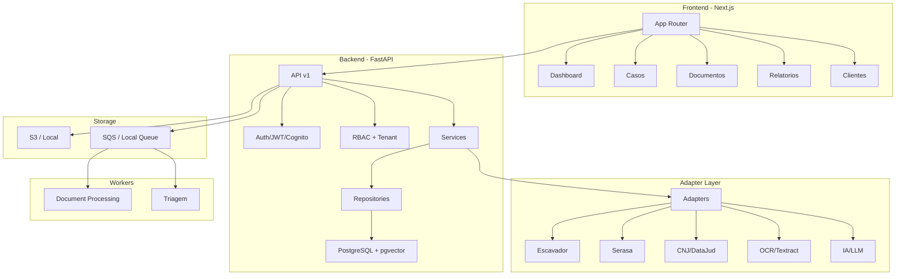
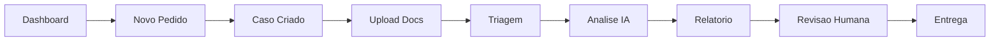

# LegalTech AWS V2 — Contrato Visto

Plataforma LegalTech modular com frontend Next.js, backend FastAPI,
PostgreSQL, auditoria LGPD, RBAC, storage de documentos, fila local/mock e
preparacao para AWS.

Esta etapa organiza ambientes, variaveis, seguranca e infraestrutura futura.
Nenhum recurso AWS real e criado por este repositorio neste momento.

## Estado Atual

- Frontend: Next.js + TypeScript + Tailwind CSS.
- Backend: FastAPI + SQLAlchemy + Alembic.
- Banco local: PostgreSQL via Docker Compose com `pgvector`.
- Auth local: JWT dev apenas para `APP_ENV=local`.
- Auth futura: validacao Cognito/JWKS preparada no backend.
- Hash de senha: Argon2id (padrao), com verificacao e migracao de hashes PBKDF2 legados e re-hash no login.
- Politica de senha: NIST (minimo 12, maximo 128 caracteres, denylist offline de senhas comuns).
- Protecao de login: rate limiting e lockout temporario por conta; `X-Forwarded-For` so e considerado atras de proxy confiavel.
- Storage: local/mock e adaptador S3 preparado.
- Filas: local/mock e adaptador SQS preparado.
- Workers: processamento de documentos + triagem com adapters mock.
- Adapters: Escavador, Serasa, CNJ, OCR, AI (todos com mock + interface para real).
- Auditoria: `audit_log` avancado com sanitizacao LGPD e mascaramento de PII (email/telefone/CPF) em cards e listas.
- Financeiro: preco do pedido congelado (snapshot) e auditado na criacao.
- Imagem do backend: production-grade (usuario non-root, sem `--reload`, `HEALTHCHECK`, uvicorn `--workers`); o dev mantem `--reload` via override do Compose.
- Infra: documentacao e checklists AWS, sem deploy real.

## Arquitetura



## Fluxo Operacional



## Estrutura

```text
legaltech-aws/
+-- apps/
|   +-- api/
|   +-- frontend/
+-- database/
+-- docs/
+-- infra/
|   +-- aws/
+-- scripts/
+-- workers/
```

## Ambientes

- `local`: Docker/PostgreSQL, JWT dev, storage local e fila local.
- `dev`: AWS futura de desenvolvimento, com Cognito.
- `staging`: validacao antes de producao.
- `prod`: producao, sem JWT dev e sem mocks.

Referencias:

- `docs/ENVIRONMENT_VARIABLES.md`
- `docs/AWS_DEPLOYMENT_PLAN.md`
- `docs/SECURITY_CHECKLIST_AWS.md`
- `infra/aws/checklist-deploy.md`

## Configuracao Local

Exemplos ficticios:

- `.env.example`
- `apps/api/.env.example.local`
- `apps/frontend/.env.example`
- `infra/aws/env.example`

Nunca versione `.env` real, tokens, senhas, access keys, chaves privadas ou
segredos de APIs externas.

## Backend

```powershell
cd legaltech-aws
docker compose up -d postgres

cd apps\api
python -m venv .venv
.venv\Scripts\python.exe -m pip install --upgrade pip
.venv\Scripts\python.exe -m pip install -r requirements.txt
Copy-Item .env.example.local .env
alembic upgrade head
uvicorn src.main:app --reload
```

Health check:

```powershell
Invoke-RestMethod http://127.0.0.1:8000/health
```

Para testar no celular na mesma rede, suba a API com `--host 0.0.0.0`,
inclua `http://192.168.0.102:3000` em `CORS_ALLOWED_ORIGINS` e use
`NEXT_PUBLIC_API_BASE_URL=http://192.168.0.102:8000` no frontend.

Validacoes:

```powershell
cd legaltech-aws\apps\api
.venv\Scripts\python.exe -m unittest discover -s tests -v
.venv\Scripts\python.exe -m compileall src tests
.venv\Scripts\python.exe -m pip check
```

## Frontend

```powershell
cd legaltech-aws\apps\frontend
npm install
Copy-Item .env.example .env.local
npm run dev
```

Abra:

```text
http://localhost:3000
```

Validacoes:

```powershell
cd legaltech-aws\apps\frontend
npm run test
npm run typecheck
npm run lint
npm run build
```

## Validacoes De Ambiente E Seguranca

Scripts offline, sem AWS real:

```powershell
cd legaltech-aws
python scripts\validate_env.py --env-file .env.example --environment local --target backend
python scripts\validate_env.py --env-file apps\frontend\.env.example --environment local --target frontend
python scripts\validate_env.py --env-file infra\aws\env.example --environment staging --target aws
python scripts\check_project_security.py .
```

Relatorio de hardening local:

- `docs/SECURITY_READY.md`

## Regras De Seguranca

- `AUTH_PROVIDER=dev_jwt` somente em `APP_ENV=local`.
- `DEV_JWT_ENABLED=false` em `dev`, `staging` e `prod`.
- O login local valida JWT dev no backend por `GET /api/v1/me` antes de salvar
  sessao no navegador.
- `AUTH_PROVIDER=cognito` e o caminho esperado para AWS.
- S3 deve ser privado por padrao.
- Upload/download de documentos deve usar presigned URL.
- `organization_id` nunca vem do frontend como fonte de verdade.
- Logs nao devem expor CPF/CNPJ completo, tokens, senhas, chaves ou contratos
  integrais.
- Secrets reais devem ficar fora do repositorio.
- Senhas sao armazenadas com Argon2id; hashes PBKDF2 legados sao verificados e migrados no login.
- Tentativas de login tem rate limiting e lockout temporario por conta.
- Decisoes de seguranca recentes documentadas em `docs/adr/ADR-0003-endurecimento-auth-local.md`.

## Workers

```powershell
# Worker de processamento de documentos
cd legaltech-aws\apps\api
.venv\Scripts\python.exe -m workers.document_processing.worker

# Worker de triagem
cd legaltech-aws
python -m workers.triagem.worker
```

## Adapter Layer — APIs Externas

Os adapters de servicos externos seguem o pattern Protocol + Mock + Factory:

| Adapter | Descricao | Config |
|---------|-----------|--------|
| Escavador | Consulta processos judiciais | `ESCAVADOR_BACKEND=mock\|real` |
| Serasa | Score de credito e restritivos | `SERASA_BACKEND=mock\|real` |
| CNJ | Consulta processual DataJud | `CNJ_BACKEND=mock\|real` |
| OCR | Extracao de texto (Textract) | `OCR_BACKEND=mock\|real` |
| AI Analysis | Analise juridica por IA | `AI_ANALYSIS_BACKEND=mock\|real` |

Para conectar um adapter real:

1. Defina `*_BACKEND=real` e `*_API_KEY=...` no `.env`.
2. Implemente os metodos na classe `Real*Adapter` em `apps/api/src/adapters/`.
3. O adapter e instanciado automaticamente no startup via `create_app()`.

## Fora Do Escopo Atual

- Deploy real em AWS.
- Criacao real de Cognito, RDS, S3, SQS, Lambda ou CloudFront.
- Terraform/CDK completo.
- Cognito Hosted UI no frontend.
- Implementacao real dos adapters (requer contrato/API key).
